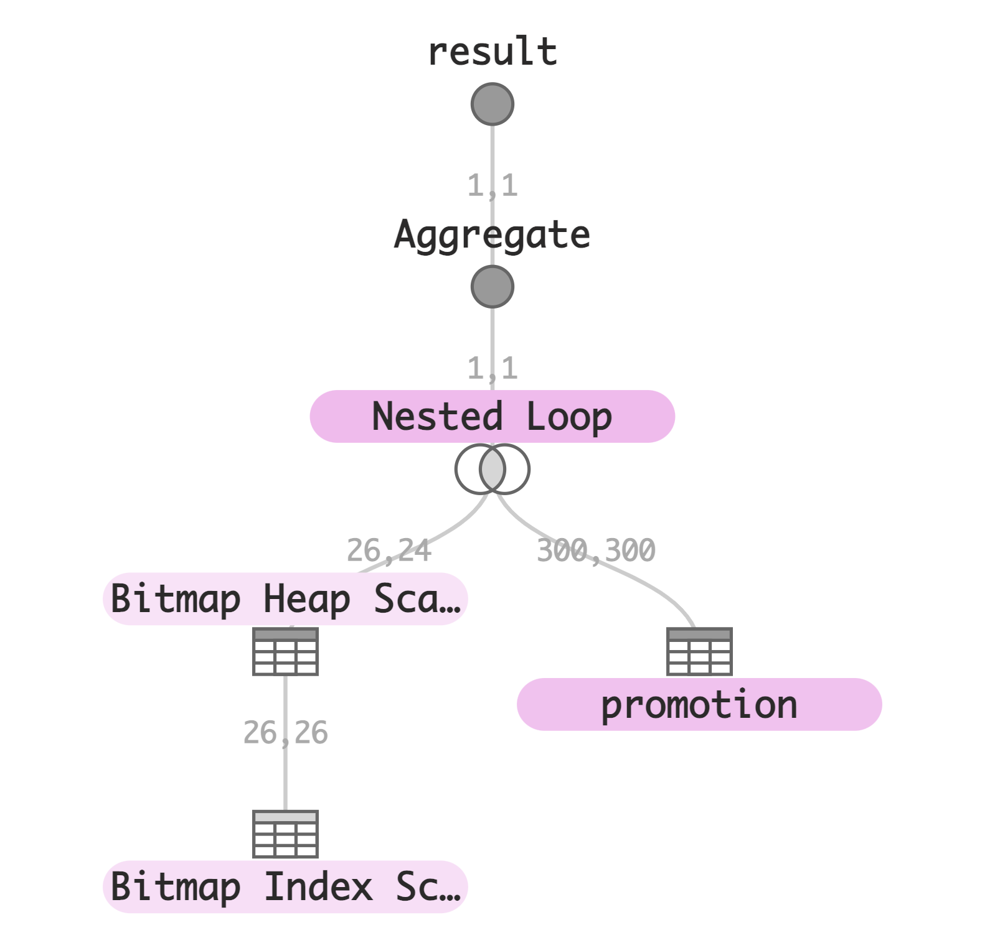
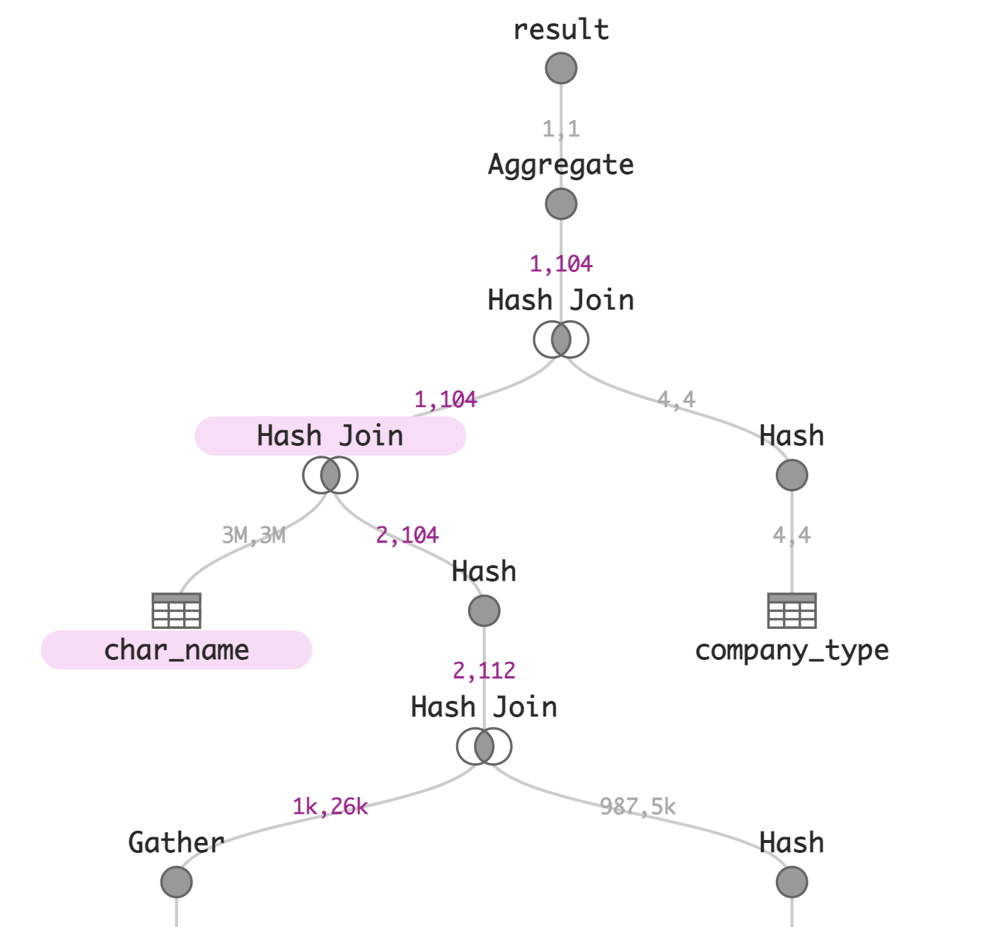

Query Graphs
============

Helping people see and understand queries - [Visualize your own query!](http://tableau.github.io/query-graphs/index.html)

Description
-----------

"Query graphs" visualizes query plans for PostgresQL, Hyper or Tableau logical queries and can easily be extended for other database systems.

Query graphs is based on the experience of Tableau and the Hyper team with debugging complex OLAP queries.
In contrast to many competing plan visualizers, query graphs:
* visualizes large and complex query plans without presenting an overwhelming amount of information,
* immediately draws your attention to tne most critical parts of the query plan through proper color coding,
* allows you to drill down on the interesting parts of the query-plan, e.g., by hovering over individual nodes,
* supports multiple different plan types (currently Postgres, Hyper and PostgresQL),
* can be easily embeded into larger tools,
* works offline.

You can find a [list of example visualizations](https://tableau.github.io/query-graphs/examples.html), a few particularly examples are:
* [PostgreSQL query plan](https://tableau.github.io/query-graphs/index.html?file=examples%2Fpostgres%2Flearning_to_optimize_federated_queries%2Fjob%2Ffederated%2Fdisable_nestloop%2F10a_ricole-lx.json&title=10a_ricole-lx.json)
* [A complex PostgreSQL query plan](http://avogelsesang.github.io/query-graphs/index.html?file=examples%2Fpostgres%2Flearning_to_optimize_federated_queries%2Fjob%2Funfederated%2Fdisable_nestloop%2F10a_dting-linux.json&title=10a_dting-linux.json)
* [Hyper query plan for TPC-H Q1](https://tableau.github.io/query-graphs/index.html?file=examples%2Fhyper%2Ftpch-q1.plan.json&title=tpch-q1.plan.json),
* [Optimizer steps of Hyper for TPC-H Q2](https://tableau.github.io/query-graphs/index.html?file=examples%2Fhyper%2Ftpch-q2-steps.plan.json&title=tpch-q2-steps.plan.json),

Usage
-----

1. Go to https://tableau.github.io/query-graphs/
2. Open your query plan, e.g. by copy pasting
3. Visually explore the query plan

Note that we never upload your query plan.
All processing happens directly inside your browser.
The query plans never leave your machine - we value your privacy ;)

Supported query plan formats:
* Postgres' JSON format, obtained by `EXPLAIN (FORMAT JSON)`. Particularly interesting if used in combination with `EXPLAIN(ANALYZE, FORMAT JSON)`
* Hyper's query plans. You can run Hyper (the database system powering Tableau) locally through HyperAPI, and send Hyper `EXPLAIN (VERBOSE)` queries to obtain query plans. See [dump-plans.py](plan-dumper/dump-plans.py) for an example.
* Tableau logical queries. Can be obtained from the log files of Tableau Desktop or Tableau Online.

Installation
------------

You can use https://tableau.github.io/query-graphs/, you do not need to install anything.
If you still need a local deployment, see the [Developer instructions](DEVELOPMENT.md) for instructions.

Contributing
------------

Pull requests welcome!

In particular, we would be happy about support for additional query plan formats from additional database systems.
New core functionality is also welcome, but you might want to open a GitHub issue first and get some feedback, before spending considerable amounts of time on cool new features.

To get started hacking on query graphs, see [DEVELOPMENT.md](DEVELOPMENT.md).

Acknowledgements
----------------

The dragging, zooming, panning, collapsing functionality originated from
“D3.js Drag and Drop, Zoomable, Panning, Collapsible Tree with Auto-Sizing” (Rob Schmuecker’s block #7880033).