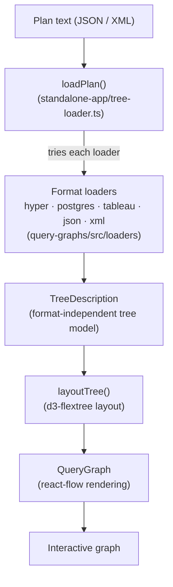

# Architecture

Query Graphs turns a database query plan into an interactive, explorable graph, entirely inside the browser.
This document gives the high-level picture; each module's `README.md` covers its internals in depth.

## Modules

The repository contains four modules.

* [`query-graphs`](../query-graphs/README.md) — the core library.
  It parses the various plan formats into one internal tree model and renders that model with React and react-flow.
  It is published to npm as `@tableau/query-graphs` and can be embedded into other tools.
* [`standalone-app`](../standalone-app/README.md) — the web app deployed at [tableau.github.io/query-graphs](https://tableau.github.io/query-graphs/).
  It wraps the core library with everything the library itself does not provide: opening files, pasting, drag & drop, link sharing, and the offline/PWA behavior.
* [`upload-server`](../upload-server/README.md) — an optional Node server that accepts an uploaded plan and hands back a shareable URL.
* [`plan-dumper`](../plan-dumper/README.md) — Python scripts that regenerate the committed example plans by running `EXPLAIN` against Hyper and Postgres.

`query-graphs` and `standalone-app` hold the core functionality.
`upload-server` and `plan-dumper` are supporting tools.

The project is a pnpm monorepo. Its three JavaScript modules are pnpm workspaces; `plan-dumper` is a standalone Python tool and is not part of the workspace.

## The "Plan Text to Graph" Pipeline

A plan is provided as a blob of text (usually JSON or XML) and ends up as a laid-out, interactive graph.
The core abstraction connecting the two halves is `TreeDescription`, the format-independent tree model produced by the loaders and consumed by the renderer.

1. The app hands the raw text to `loadPlan` (`standalone-app/src/tree-loader.ts`), which tries each loader in turn and keeps the first that succeeds.
2. The winning loader (e.g. `query-graphs/src/loaders/hyper.ts`) transforms the source structure into a `TreeDescription`.
   This is where format-specific knowledge lives: how to name nodes, which children to show or collapse, which icon to use, how to label edges.
3. `layoutTree` (`query-graphs/src/ui/tree-layout.ts`) assigns positions using `d3-flextree`, driven by the measured on-screen size of each node.
4. `QueryGraph` (`query-graphs/src/ui/QueryGraph.tsx`) renders the positioned tree with react-flow, and a Zustand store tracks interaction state such as which nodes are expanded.

Adding a new database's plan format only requires writing a new loader that outputs a `TreeDescription`.
All database-specific logic must be encapsulated in the loaders.
The layout and rendering stages should stay database-agnostic.
See [Plan Formats and Loaders](PlanFormatsAndLoaders.md) for the step-by-step guide, and the [`query-graphs` README](../query-graphs/README.md) for the `TreeDescription` model and the renderer.
